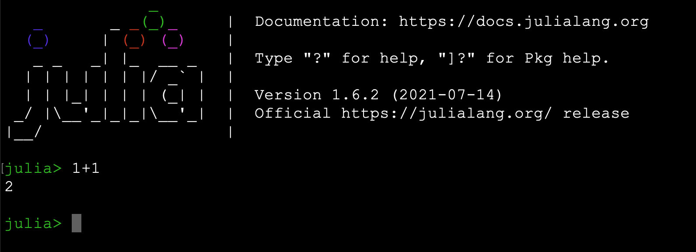

# GSA/AGU workshop setup guideline

## Contents

The `Workshop` will showcases how to code and perform machine-learning analyses in Julia.
Especially, we will demonstrate what tools are good for geoscientific data analysis.
We will cover a series of general, frequently-solved ML tasks such as:
* Unsupervised and supervised machine learning

The unsupervised machine learning methods are:
* k-means clustering
* principal component analysis
* non-nnegative matrix factorization
* non-negative matrix factorization with customized k-means clustering

The supervised machine learning are:
* deep neural network
* convolutional neural network

We will also demonstrate guided tutorials using real data 
* Spatiotemporal data analytics
* GeoThermal exploration
* Filling datagaps


## Getting Started

Download and install [the latest version of Julia](https://julialang.org/downloads/).
The current stable version is Julia 1.6.2.

### Linux installation

```bash
	wget https://julialang-s3.julialang.org/bin/linux/x64/1.6/julia-1.6.2-linux-x86_64.tar.gz
	tar xvzf julia-1.6.2-linux-x86_64.tar.gz
```

The julia executable is `julia-1.6.2/bin/julia` which will open the Julia REPL.
You can add in your PATH `julia-1.6.2/bin` or link `julia-1.6.2/bin/julia` to your default `bin` folder in your PATH.

Using `apt-get` is not recommended.

### Mac OS X installation

After downloading [the latest version of Julia](https://julialang.org/downloads/) and installing, the julia executable is `/Applications/Julia-1.6.app/Contents/Resources/julia/bin/julia`.

You can add in your PATH:

``` bash
	export PATH="/Applications/Julia-1.6.app/Contents/Resources/julia/bin:$PATH"
```

Using `brew` or `mac-ports` is not recommended.

### Windows installation

Download and install [the latest version of Julia](https://julialang.org/downloads/).
This will give you the Julia 1.6.2 program.
Opening this program will open a Julia REPL.

### Julia REPL

Julia REPL looks like this:



### Julia and GIT

Julia uses GIT for package management.
GIT needs to be installed and configured as well.

To make Julia and GIT work behind the LANL (or different institute) firewall execute:

``` bash
	export ALL_PROXY=proxyout.lanl.gov:8080
	export ftp_proxy=http://proxyout.lanl.gov:8080
	export rsync_proxy=http://proxyout.lanl.gov:8080
	export http_proxy=http://proxyout.lanl.gov:8080
	export https_proxy=http://proxyout.lanl.gov:8080
	export no_proxy=.lanl.gov
```

You can also do this in the Julia REPL:

```julia
	ENV["ALL_PROXY"] =  "http://proxyout.lanl.gov:8080"
	ENV["ftp_proxy"] =  "http://proxyout.lanl.gov:8080"
	ENV["rsync_proxy"] = "http://proxyout.lanl.gov:8080"
	ENV["http_proxy"] = "http://proxyout.lanl.gov:8080"
	ENV["https_proxy"] = "http://proxyout.lanl.gov:8080"
	ENV["no_proxy"] = ".lanl.gov"
```

### Jupyter Notebooks

Jupyter notebooks are in-browser interactive programming environments that we will use for this workshop.
The notebooks are run through IJulia.

To install IJulia seperately, open a Julia REPL and run:

```julia
	ENV["PYTHON"] = ""
	import Pkg
	Pkg.add("IJulia")
```

To open a Jupyter Notebook session in your browser, run the following in a REPL:

```julia
	import IJulia
	IJulia.notebook()
```

The first time you run this, it will install `jupyter` using `conda`.

The `Workshop` has following notebooks (in the notebook directory) that can be executed in Jupyter or in the Julia REPL.
* Julia_Introduction
* Unsupervised_ML
* Supervised_ML
* Geothermalcloud

## Required packages/modules to run the above mentioned notebooks
```julia
	ENV["PYTHON"] = ""
	import Pkg
	Pkg.add("NMF")
	Pkg.add("Clustering")
	Pkg.add("Statistics")
	Pkg.add("MultivariateStats")
	Pkg.add("Distances")
	Pkg.add("Random")
	Pkg.add("Mads")
	Pkg.add("NMFk")
	Pkg.add("DelimitedFiles")
	Pkg.add("Cairo")
	Pkg.add("Fontconfig")
	Pkg.add("Gadfly")
	Pkg.add("Compose")
	Pkg.add("GMT") # this is not mandatory but an alternative tool of ArcGIS
```


## Julia support

The official Julia documentation is available at [https://docs.julialang.org](https://docs.julialang.org).

The official Julia [discourse https://discourse.julialang.org](https://discourse.julialang.org) is an excellent resource for all kind of questions and insights in addition to [Stack Overflow](https://stackoverflow.com/questions/tagged/julia).

In the Julia community, it is not recommended to push pull requests, submit coding issues, or ask questions before you have checked for existing answers or insights at the [Julia discourse website](https://discourse.julialang.org).

